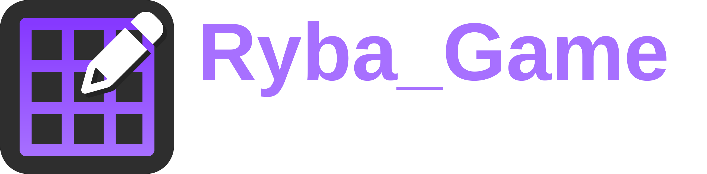
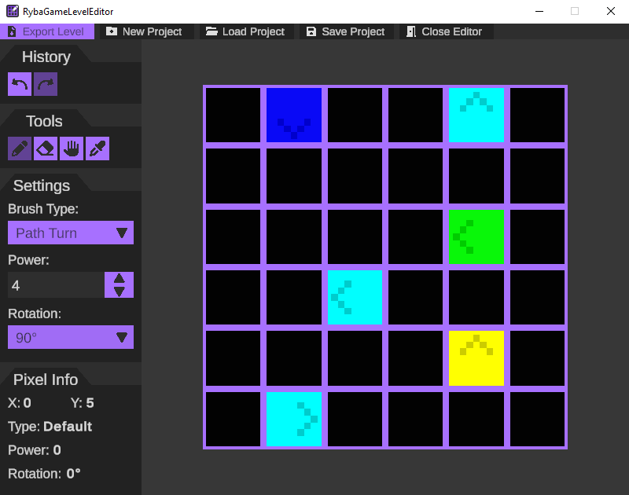
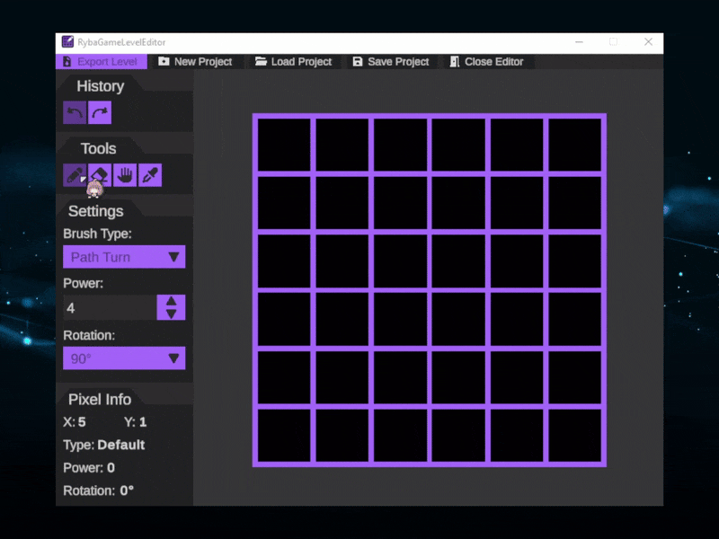

  
    

**RybaGameLevelEditor** is a Unity-based level editor that allows creating game levels by drawing the map as a pixel-based image.
Each pixel represents a single tile, and its color (RGBA) encodes the tile type, rotation, and power.

This editor is designed to provide:

* an intuitive level creation workflow,
* editable maps both within the editor and in standard image editors,
* a clear, lossless level data format.

## Overview

  
    

* **Level = Texture2D**
* **1 pixel = 1 map tile**
* **RGB channels** → tile type
* **Alpha channel** → additional data (rotation and power)

The editor can generate a level from the drawn image, save it as a project, and export the map in formats readable by the game.

## Features

  

### Tools

* **Brush** – draw tiles with a selected type, power, and rotation
* **Eraser** – remove tiles and reset to default
* **Displacer** – move sections of the map
* **Pipette** – sample tile data from the map

### Navigation

* zoom in/out with mouse scroll
* move the map using mouse drag or scroll
* automatic fit-to-view scaling

### Editing

* visible **grid overlay**
* pixel pointer indicator
* real-time tile info display (position, type, power, rotation)

### Undo/Redo

* full history support for all actions
* multi-pixel operations supported
* displacer movement correctly handled in history

## Project & Map Saving

### Map Export

Supported image formats:

* **PNG**
* **QOI**

Use lossless formats only to ensure exact color data. Avoid anti-aliasing, color correction, and lossy compression.

### Project Save (`.lep`)

The editor provides a **binary project format** which stores:

* map dimensions
* only modified tiles (optimized storage)
* metadata (date, editor version, format version)
* file integrity check using magic bytes

Project files allow:

* resuming work safely
* versioned compatibility checks
* fast loading and saving of large maps

## Level Data Encoding (RGBA)

The detailed documentation for tile encoding is available here:

**[Level Data Storage Using Colors (RGBA)](./LevelDataStorage.md)**

Summary:

* **RGB channels**: tile ID (Tile Type)
* **Alpha channel (8 bits)**:

  * 6 bits → `power` (0–63, inverted logic)
  * 2 bits → `rotation` (0–3, 90° increments)

This ensures:

* visually readable levels,
* precise and unambiguous data,
* editable levels in external image editors.

## Release Info & Tags

**Current Release:** [v1.0.0](https://github.com/Muppetsg2/RybaGameLevelEditor/releases/v1.0.0)\
**Release Notes:** First full-featured stable version.\
**Tags:** `Unity`, `Level Editor`, `Tile Map`, `Pixel Art`, `Game Development`

## Technologies

* Unity
* C#
* `Texture2D` for pixel-perfect rendering
* Unity UI for interactions
* Command pattern for undo/redo system

## Notes

* Tile colors must be exact, without interpolation or lossy compression.
* Using a prepared **color palette** for designers is recommended.
* The editor and format are designed for further extensibility.
